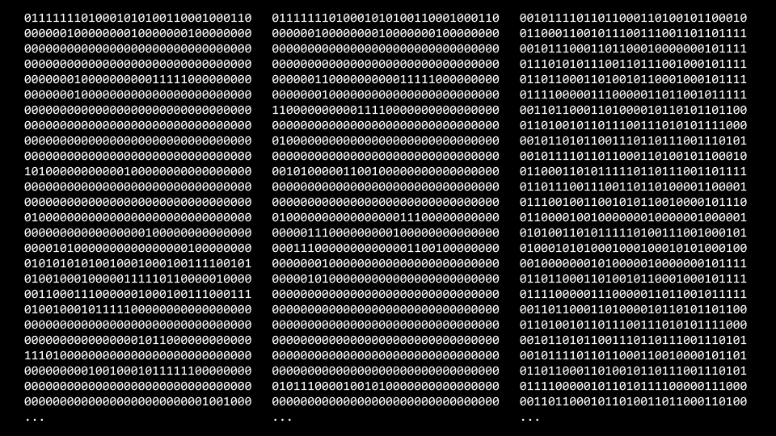

# Week 2 Arrays

Sources: [Lecture 2](https://cs50.harvard.edu/x/2023/notes/2/) | [Functions](https://cdn.cs50.net/2017/fall/shorts/functions/functions.pdf) | [Variables Scope](https://cdn.cs50.net/2017/fall/shorts/variables_and_scope/variables_and_scope.pdf) | [Arrays](https://cdn.cs50.net/2017/fall/shorts/arrays/arrays.pdf) | [Command Line Arguments](https://cdn.cs50.net/2017/fall/shorts/command_line_arguments/command_line_arguments.pdf)

## Functions

- builds on [Week 1: Abstraction](week-01.md#abstraction)
- sometimes also known as procedures, methods, or subroutines
- black box with a set of 0+ inputs and 1 output

```c
// return_type func_name(arg_list);

int sum(int a, int b);
```

- in the declaration above:
	- `return_type` is what kind of variable the function will output
	- `func_name` is a name of a function
	- `argument_list` is the comma-separated set of inputs to a function, each of which has a type and a name

## Variables Scope

- *local variables* can only be accessed within the functions in which they are created
- *global variables* can be accessed by any function in the program

## Compiling

- *compiler* is a specialized computer program that converts *source code* into *machine code*
- CS50's VS Code workspace utilizes a compiler called *clang*
- CLI command `make hello` is CS50-only; outside CS50 class one can use CLI command `clang -o hello hello.c -lcs50`, where:
	- `-o` is a modificator "output" for renaming
	- `hello` is a name of the output program
	- `hello.c` is a source file
	- `-lcs50` enables the compiler to access `cs50.h` library

### 1. Preprocessing

- content of header files (.h files, e.g. `cs50.h`), designated by a `#` (such as `#include`), is copied and pasted into a *source code*

```
...
string get_string(string prompt);
int printf(string format, ...);
...

int main(void)
{
	string name = get_string("What's your name? ");
	printf("Hello, %s\n", name);
}
```

### 2. Compiling

- *source code* is converted into *assembly code*


### 3. Assembling

- *assembly code* is converted into *machine code*


### 4. Linking

- code from included libraries (.c files, e.g. `cs50.c`) is converted into *machine code* and combined with *machine code* from previous step



## Debugging

- `printf()` funtion
- command line debugger `debug50 ./program` (CS50-only)
- rubber duck debugging

## Arrays and Strings

- *arrays* are a way of storing data back-to-back in memory
- they cannot be treated as variables, cannot be assigned to another array (`for loop` is needed to copy their elements, one at a time)
- unlike variables, which are passed by value in function calls, arrays are **passed by reference** (the callee receives the actual array, not a copy of it)

```c
// type arr_name[size];

bool truthtable[] = { false, true, true };
bool battleship[10][10];
```

- *string* is an array of variables of type `char`


- `string.h` library functions:
	- `strlen` calculates the length of the string passed to it
	- `strcmp` compares values of two strings and returns `0` if they are equal
- `ctype.h` library functions:
	- `islower` checks if a `char` is lowercase
	- `tolower` converts a `char` to lowercase
	- `toupper` converts a `char` to uppercase

## Command Line Arguments

- command line arguments are data provided to a program before it starts executing

```c
#include <cs50.h>
#include <stdio.h>

int main(int argc, string argv[])
{
	if (argc == 2)
	{
		printf("Hello, %s\n", argv[1]);
	}
	else
	{
		printf("Hello, world\n");
	}
}  
```

- in the code above:
	- `argc` (argument count) is an integer-type variable that stores the number of command line arguments
	- `argv` (argument vector) is an array that stores the command line arguments, one **string** per element 

```
$ ./greedy 1024 cs50
```

- in the command above:
	- `argc` = 3
	- `argv[0]` = "./greedy"
	- `argv[1]` = "1024"
	- `argv[2]` = "cs50"

## Exit Status

- when a program ends, an exit code is provided to the computer
- terminal command `echo $?` returns status code in which program ended (`0` if program exits without an error)

```c
#include <cs50.h>
#include <stdio.h>

int main(int argc, string argv[])
{
	if (argc != 2)
	{
		printf("Missing command line argument\n");
		return 1;
	}
	printf("Hello, %s\n", argv[1]);
	return 0;
}
```
