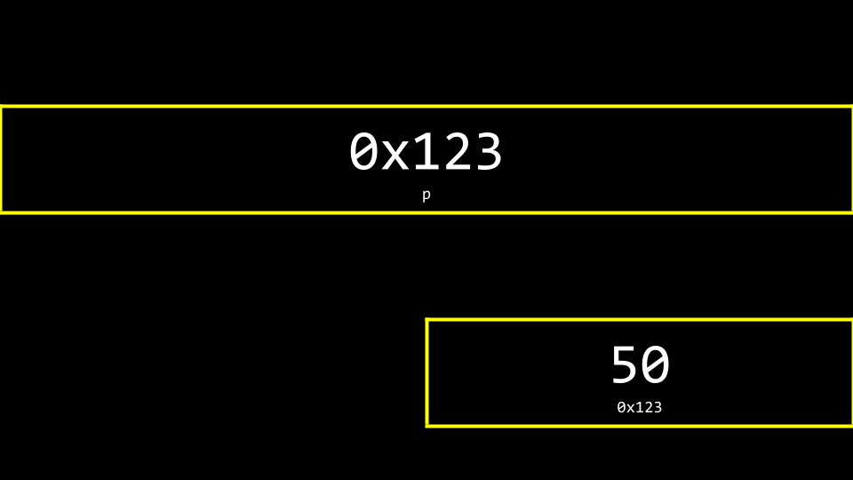
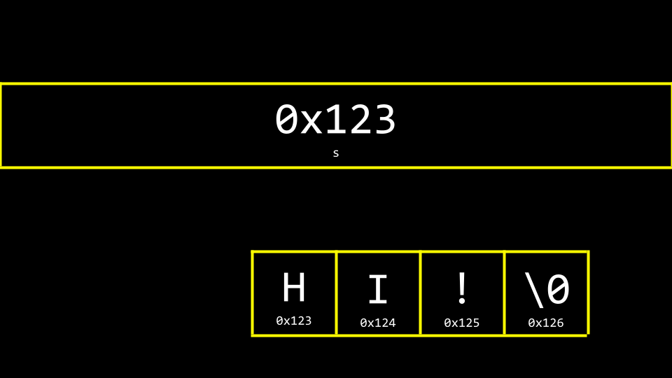
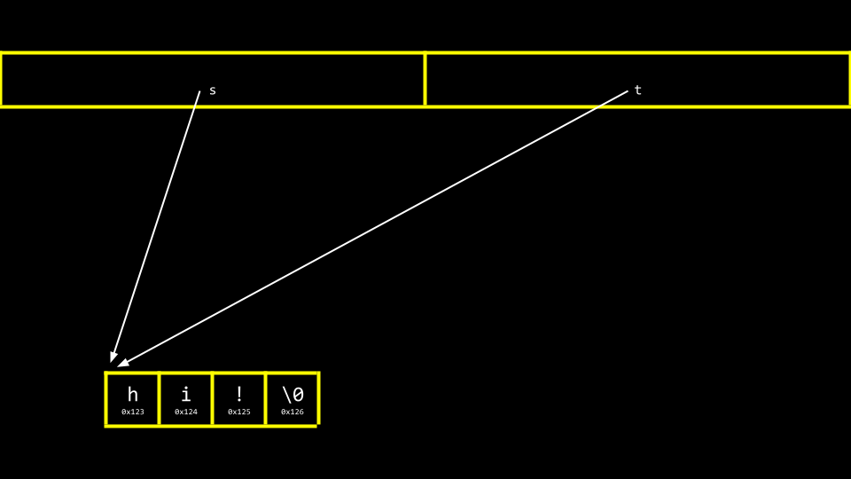

# Week 4 Memory

Sources: [Lecture 4](https://cs50.harvard.edu/x/2023/notes/4/) | [Hexadecimal](https://cdn.cs50.net/2017/fall/shorts/hexadecimal/hexadecimal.pdf) | [Pointers](https://cdn.cs50.net/2017/fall/shorts/pointers/pointers.pdf) | [Defining Custom Types](https://cdn.cs50.net/2017/fall/shorts/custom_types/custom_types.pdf) | [Dynamic Memory Allocation](https://cdn.cs50.net/2017/fall/shorts/dynamic_memory_allocation/dynamic_memory_allocation.pdf) | [Call Stack](https://cdn.cs50.net/2017/fall/shorts/call_stacks/call_stacks.pdf) | [File Pointers](https://cdn.cs50.net/2017/fall/shorts/file_pointers/file_pointers.pdf)

## Hexadecimal

- most Western cultures use *decimal system* (base-10), while computers use *binary system* (base-2); for more information, see [Week 0: Computational Thinking](week-00.md#computational-thinking)
- *hexadecimal system* (base-16) is a more concise way to express the data on computer's system
	- `0 1 2 3 4 5 6 7 8 9 A B C D E F`
	- ... + ? x 16^2 + ? x 16^1 + ? x 16^0
	- `[0 0]` = 0; `[0 A]` = 10; `[1 0]` = 16; `[F F]` = 255
	- binary `[1 1 1 1 1 1 1 1]` = hexadecimal `[F F]`
- this way, 4 bits of binary information can be consolidated into 1 bit hexadecimal information

```
// Base binary number
01000110101000101011100100111101

// Separated into groups of 4
0100 0110 1010 0010 1011 1001 0011 1101

// Returned decimal value
4 6 10 2 11 9 3 13

// Returned hexadecimal value
4 6 A 2 B 9 3 D

// Final hexadecimal number
0x46A2B93D
```

## Addresses

- addresses in computer's memory are defined using hexadecimal numbering
- by convention, all hexadecimal numbers are often represented with the 0x prefix, e.g. 0x3, 0x1A

```c
int main(void)
{
	int n = 50;
	
	// Print address
	printf("%p\n", &n);
}
```

- in the code above, variable `n` stores a value 50 somewhere in memory, with hexadecimal address 0x123


- operators that relate to memory:
	- `&` provides the address of something stored in memory
	- `%p` is a placeholder for an address, e.g. `printf(“%p\n”, &n)` displays an address of a variable `n`
	- `*` instructs the compiler to go to a location in memory

## Pointers

- *pointer* is a variable that contains the address of some value; it is an address in computer's memory
- with pointers, it is possible to **pass data by reference** between functions (means that functions can e.g. change variables defined outside of their scope)
- pointers are defined using `type *var_name`
- `*` is an important part of both the type name and the variable name; that means:
	- `int *a, b, c;` is an incorrect way to define multiple pointers 
	- `int *a, *b, *c;` is a correct way to do so
- pointers should always be initialized:
	- either by `NULL`, which points to nothing
	- or by an address of an existing variable using `&` symbol
- dereferencing (accessing a value on an address pointer holds) is done using dereference operator `*`

```c
#include <stdio.h>

int main(void)
{
	// Create variable "n" with a value 50
	int n = 50;
	
	// Initiate address of "n" into pointer "p"
	int *p = &n;
	
	// Print address of "n"
	printf("%p\n", &n);
	
	// Print value of "n"
	printf("%i\n", n);
	
	// Print value of pointer "p" (address of "n")
	printf("%p\n", p);
	
	// Print value on pointer "p" (value of "n")
	printf("%i\n", *p);
}
```



## Strings

- string in C is actually a pointer with an address of the first `char`, that ends with a null character `\0`



```c
#include <stdio.h>

int main(void)
{
	char *s = "HI!";
	printf("%s\n", s);
}
```

## Pointer Arithmetic

```c
#include <stdio.h>

int main(void)
{
	char *s = "HI!";
	
	// Print 2nd char ("I")
	printf("%c\n", *(s + 1));
	
	// Print substring starting from 2nd char ("I!")
	printf("%s\n", s + 1);
}
```

## Comparing Strings

- `string1 == string2` compares the memory locations of the strings instead of the characters therein


- it is recommended to use `strcmp()` function to compare strings

## Heap-Stack Memory Allocation


### Stack

- *stack* is a pool of statically allocated memory

```c
int x;
float stack_array[x];
```

- when a function is called, it is stored (with its local variables) on top of the stack
- last called function is executed first (LIFO)
- statically allocated memory is **automatically returned to the system when the function finishes execution**

### Heap

- *heap* is a pool of dynamically allocated memory, and is utilized via `malloc()` and `free()` from `stdlib.h` library

```c
int *px = malloc(sizeof(int));
float *heap_array = malloc(x * sizeof(float));
```

- `malloc()` is used to get dynamically allocated memory; if it cannot allocate enough memory, it returns `NULL`
- dynamically allocated memory must be returned manually via `free()` 

```c
char *word = malloc(50 * sizeof(char));

/* do_something */

free(word);
```

- three golden rules:
	- every block of memory allocated via `malloc()` must subsequently be `free()`d
	- only memory allocated via `malloc()` should be `free()`d
	- do not `free()` a block of memory more than once

### Buffer Overflow

- *heap overflow* is when program is touching areas of memory it is not supposed to
- *stack overflow* is when too many functions are called, overflowing the amount of memory available
- both of these are considered *buffer overflow*

## Copying Strings

- **initializing one string variable into another results in copying its address**; changing values of one them changes values of the other one as well

```c
#include <cs50.h>
#include <ctype.h>
#include <stdio.h>
#include <string.h>

int main(void)
{
	// Get a string
	string s = get_string("s: ");
	
	// Copy string's address
	string t = s;
	
	// Capitalize first letter in string
	if (strlen(t) > 0)
	{
		t[0] = toupper(t[0]);
	}
	
	// Print string twice
	printf("s: %s\n", s);
	printf("t: %s\n", t);
}
```



- to copy **values** of strings, it is necessary to use `malloc()` and `free()` functions

```c
#include <cs50.h>
#include <ctype.h>
#include <stdio.h>
#include <stdlib.h>
#include <string.h>

int main(void)
{
	// Get a string
	char *s = get_string("s: ");
	if (s == NULL)
	{
		return 1;
	}
	
	// Allocate memory for another string
	char *t = malloc(strlen(s) + 1);
	if (t == NULL)
	{
		return 1;
	}
	
	// Copy string into memory
	strcpy(t, s);
	
	// Capitalize copy
	if (strlen(t) > 0)
	{
		t[0] = toupper(t[0]);
	}
	
	// Print strings
	printf("s: %s\n", s);
	printf("t: %s\n", t);
	
	// Free memory
	free(t);
	return 0;
}
```

- in the code above:
	- `get_string()` and `malloc()` may return `NULL` (a special value in memory, in the event that something goes wrong) - it is necessary to check for this condition
	- `malloc()` creates a block of memory that is the length of the original string + 1 (including null character `\0`)
	- `strcpy(destination, source)` is a built-in function to copy strings
	- `free()` frees memory allocated via `malloc()`

## valgring

- *valgrind* is a tool that can check to see if there are memory-related issues with programs; specifically, it checks to see if all allocated memory was freed
- it is executed by terminal command `valgrind ./program`

## Garbage Values

- if a variable is not initialized, junk or garbage value (previously utilized by the computer) can be assigned to it; the best practice is to always initialize variables

## Swap

- to swap values of two variables, third (temporary) variable is needed


- in the image above, `main()` and `swap()` functions are in two separate areas of stack pool of memory; therefore, it is not possible to simply pass the values from one function to another to change them
- it is necessary to pass variables **by reference** instead of by value

```c
#include <stdio.h>

void swap(int *a, int *b);

int main(void)
{
	int x = 1;
	int y = 2;
	
	printf("x is %i, y is %i\n", x, y);
	swap(&x, &y);
	printf("x is %i, y is %i\n", x, y);
}

void swap(int *a, int *b)
{
	int tmp = *a;
	*a = *b;
	*b = tmp;
}
```


## scanf

- `scanf()` is a built-in function that can get user input
- it is used in `cs50.h` library functions `get_int()`, `get_string()`, ...
- `get_int()` can be natively reimplemented as follows:

```c
#include <stdio.h>

int main(void)
{
	int x;
	printf("x: ");
	scanf("%i", &x);
	printf("x: %i\n", x);
}
```

- `get_string()` can be (with pre-defined maximum length) reimplemented as follows:

```c
#include <stdio.h>

int main(void)
{
	char s[4];
	printf("s: ");
	scanf("%s", s);
	printf("s: %s\n", s);
}
```

## Files

- pointers are used to access, read and manipulate files

```c
#include <cs50.h>
#include <stdio.h>
#include <string.h>

int main(void)
{
	// Open CSV file
	FILE *file = fopen("phonebook.csv", "a");
	
	// Get name and number
	char *name = get_string("Name: ");
	char *number = get_string("Number: ");
	
	// Print to file
	fprintf(file, "%s,%s\n", name, number);
	
	// Close file
	fclose(file);
}
```

### File Pointers

- once program finishes, all its data disappear
- to store **persistent data**, the ability to read data from and write data to files is needed
- the file manipulation functions all live in `stdio.h` library
- some of the most common file input/output (I/O) functions are:
	- `fopen()`
	- `fclose()`
	- `fgetc()`
	- `fputc()`
	- `fread()`
	- `fwrite()`
- `fopen(file_name, operation)`
	- opens a file and returns a file pointer to it (always check, that it does not return `NULL`)

```c
// Open file to read ("r")
FILE *file1 = fopen("file1.txt", "r");

// Open file to write ("w") - overwrite data in a file
FILE *file2 = fopen("file2.txt", "w");

// Open file to append ("a") - add to existing data in a file
FILE *file3 = fopen("file3.txt", "a");
```

- `fclose(file_pointer)`
	- closes the file pointed to by the given file pointer

```c
fclose(file1);
```

- `fgetc(file_pointer)`
	- reads and returns the next character from the file pointed to
	- file pointer passed in as a parameter must be “r” for read

```c
char c = fgetc(file1);

// Read and print file content (EOF = end of file), Linux "cat" command
char c;
while((c = fgetc(file1)) != EOF)
	printf("%c", c);
```

- `fputc(char, file_pointer)`
	- writes or appends the specified char to the pointed-to file
	- file pointer passed in as a parameter must be “w” for write or “a” for append

```c
fputc("A", file2);

// Copy content from one file to another, Linux "cp" command
char c;
while((c = fgetc(file1)) != EOF)
	fputc(c, file2);
```

- `fread(buffer, size, qty, file_pointer)`
	- reads `qty` units of `size` from the file pointed to and stores them in memory in a buffer (usually an array) pointed to by `buffer`
	- file pointer passed in as a parameter must be “r” for read

```c
// Example 1 - save into array statically (into stack)
int arr[10];
fread(arr, sizeof(int), 10, file1);

// Example 2 - save into array dynamically (into heap)
double *arr2 = malloc(sizeof(double) * 80);
fread(arr2, sizeof(double), 80, file1);

// Example 3
char c;
fread(&c, sizeof(char), 1, file1);
```

- `fwrite(buffer, size, qty, file_pointer)`
	- writes `qty` units of `size` to the file pointed to by reading them from a buffer (usually an array) pointed to by `buffer`
	- file pointer passed in as a parameter must be “w” for write or “a” for append

## Defining Data Types

- `typedef` provides a way to create a shorthand or rewritten name for data types

```c
typedef /* old_name */ /* new_name */;
typedef unsigned char byte;
typedef char * string;
```
