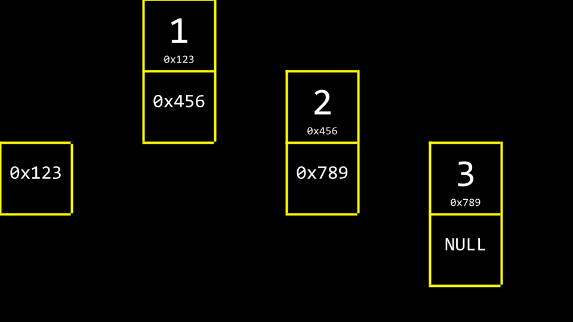
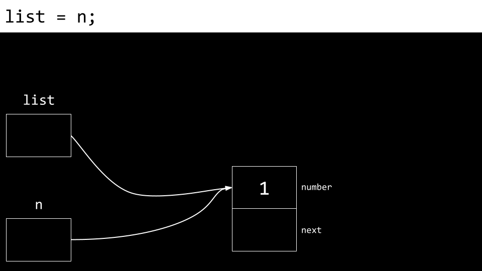
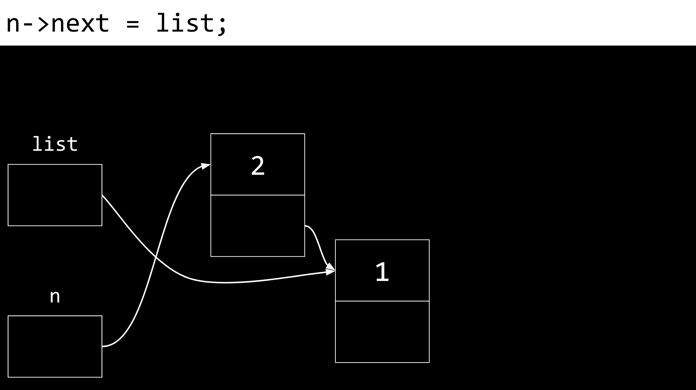
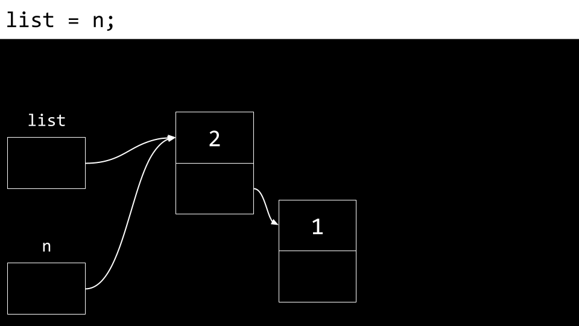
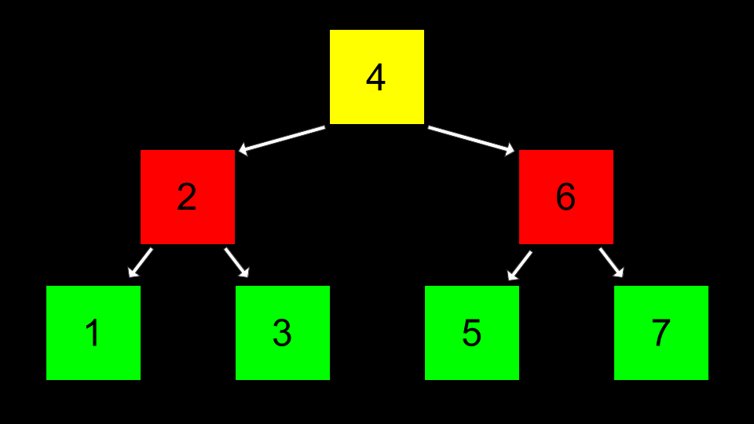

# Week 5 Data Structures

Sources: [Lecture 5](https://cs50.harvard.edu/x/2023/notes/5/) | [Data Structures](https://cdn.cs50.net/2017/fall/shorts/data_structures/data_structures.pdf) | [Structures](https://cdn.cs50.net/2017/fall/shorts/structures/structures.pdf) | [Singly-Linked Lists](https://cdn.cs50.net/2017/fall/shorts/singly_linked_lists/singly_linked_lists.pdf) | [Doubly-Linked Lists](https://cdn.cs50.net/2017/fall/shorts/doubly_linked_lists/doubly_linked_lists.pdf) | [Hash Tables](https://cdn.cs50.net/2017/fall/shorts/hash_tables/hash_tables.pdf) | [Tries](https://cdn.cs50.net/2017/fall/shorts/tries/tries.pdf) | [Queues](https://cdn.cs50.net/2017/fall/shorts/queues/queues.pdf) | [Stacks](https://cdn.cs50.net/2017/fall/shorts/stacks/stacks.pdf)

## Data Structures

- *data structures* (arrays, linked lists, hash tables, tries) essentially are forms of organization in memory
- *abstract data structures* are those that can be conceptually imagined

## Resizing Arrays

- for more information, see [Week 2: Arrays and Strings](week-02.md#arrays-and-strings)
- arrays (such as 1 2 3) are blocks of contiguous memory


```c
// Implements a list of numbers with an array of dynamic size

#include <stdio.h>
#include <stdlib.h>

int main(void)
{
	// List of size 3
	int *list = malloc(3 * sizeof(int));
	if (list == NULL)
	{
		return 1;
	}
	
	// Initialize list of size 3 with numbers
	list[0] = 1;
	list[1] = 2;
	list[2] = 3;
	
	// List of size 4
	int *tmp = malloc(4 * sizeof(int));
	if (tmp == NULL)
	{
		free(list);
		return 1;
	}
	
	// Copy list of size 3 into list of size 4
	for (int i = 0; i < 3; i++)
	{
		tmp[i] = list[i];
	}
	
	// Add number to list of size 4
	tmp[3] = 4;
	
	// Free list of size 3
	free(list);
	
	// Remember list of size 4
	list = tmp;
	
	// Print list
	for (int i = 0; i < 4; i++)
	{
		printf("%i\n", list[i]);
	}
	
	// Free list
	free(list);
	return 0;
}
```

- in the code above, to store a fourth value (4) into (1, 2, 3) array, allocating a new area of memory and moving the old array to a new one is needed; which is a bad design, as every time number is added, array has to be copied item by item

```c
// Implements a list of numbers with an array of dynamic size using realloc

#include <stdio.h>
#include <stdlib.h>

int main(void)
{
	// List of size 3
	int *list = malloc(3 * sizeof(int));
	if (list == NULL)
	{
		return 1;
	}
	
	// Initialize list of size 3 with numbers
	list[0] = 1;
	list[1] = 2;
	list[2] = 3;
	
	// Resize list to be of size 4
	int *tmp = realloc(list, 4 * sizeof(int));
	if (tmp == NULL)
	{
		free(list);
		return 1;
	}
	list = tmp;
	
	// Add number to list
	list[3] = 4;
	
	// Print list
	for (int i = 0; i < 4; i++)
	{
		printf("%i\n", list[i]);
	}
	
	// Free list
	free(list);
	return 0;
}
```

- in the code above, `realloc()` is used instead of `malloc()` 
- `realloc()` handles reallocating memory by itself, as it:
	- allocates a new memory
	- copies data from previous memory into the new one
	- frees previous memory

## Structures

- builds on [Week 3: Structures](week-03.md#structures)
- *structures* (structs) provide a way to unify several variables of different types into a single, new variable type which can be assigned its own type name

```c
struct car
{
	int year;
	char model[10];
	char plate[7];
	int odometer;
	double engine_size;
};
```

- structs are typically defined in separate .h files
- struct fields (or members) can be accessed using dot notation

```c
// Static variable declaration
struct car mycar;

// Field accessing
mycar.year = 2011;
strcpy(mycar.plate, "CS50");
mycar.odometer = 50505;
```

- structs can be created statically (into stack), or dynamically (into heap)
- fields of dynamically allocated structs can be access after pointers to the structs are dereferenced first
- arrow operator `->`:
	1. dereferences the pointer on the left side of the operator
	2. accessed the field on the right side of the operator

```c
// Dynamic variable declaration
struct car *mycar = malloc(sizeof(struct car));

// Field accessing using -> operator
mycar->year = 2011;
strcpy(mycar->plate, "CS50");
mycar->odometer = 50505;
```

## Linked Lists

- linked list is a data structure that allows to include values located at varying areas of memory




- these boxes are called *nodes* and each of them contain both an *item* and a pointer called *next*

```c
typedef struct node
{
	int number;
	struct node *next;
}
node;
```

- in the code above:
	- first, temporary name for `typedef` is defined (such as `struct node`)
	- in the elements definition, temporary name `struct node` is used
	- final `typedef` name `node` is defined **after** the definition
- downsides of linked lists:
	- more memory is required to keep track of the list instead of an array
	- cannot be indexed into like is possible in an array
	- binary search is not possible

### Process of Creating a Linked List

1. `node *list` is declared


2. node called `n` is allocated in memory


3. node's `number` field is assigned the value 1


4. node's `next` field is assigned `NULL`


5. `list` is pointed at the memory location to where `n` points (both now point to the same place)



6. new node is allocated in memory


7. new node's `number` field is assigned the value 2


8. new node's `next` field is assigned `NULL`


9. new node's `next` field is pointed to the same memory location as `list`



10. `list` is updated to point at `n`



### Prepending to a Linked List

```c
// Prepends numbers to a linked list, using for loop to print

#include <cs50.h>
#include <stdio.h>
#include <stdlib.h>

typedef struct node
{
	int number;
	struct node *next;
}
node;

int main(int argc, char *argv[])
{
	// Memory for numbers
	node *list = NULL;
	
	// For each command-line argument
	for (int i = 1; i < argc; i++)
	{
		// Convert argument to int
		int number = atoi(argv[i]);
		
		// Allocate node for number
		node *n = malloc(sizeof(node));
		if (n == NULL)
		{
			return 1;
		}
		n->number = number;
		n->next = NULL;
		
		// Prepend node to list
		n->next = list;
		list = n;
	}
	
	// Print numbers
	for (node *ptr = list; ptr != NULL; ptr = ptr->next)
	{
		printf("%i\n", ptr->number);
	}
	
	// Free memory
	node *ptr = list;
	while (ptr != NULL)
	{
		node *next = ptr->next;
		free(ptr);
		ptr = next;
	}
}
```

### Appending to a Linked List

```c
// Implements a list of numbers using a linked list

#include <cs50.h>
#include <stdio.h>
#include <stdlib.h>

typedef struct node
{
	int number;
	struct node *next;
}
node;

int main(int argc, char *argv[])
{
	// Memory for numbers
	node *list = NULL;
	
	// For each command-line argument
	for (int i = 1; i < argc; i++)
	{
		// Convert argument to int
		int number = atoi(argv[i]);
		
		// Allocate node for number
		node *n = malloc(sizeof(node));
		if (n == NULL)
		{
			return 1;
		}
		n->number = number;
		n->next = NULL;
		
		// If list is empty
		if (list == NULL)
		{
			// This node is the whole list
			list = n;
		}
		
		// If list has numbers already
		else
		{
			// Iterate over nodes in list
			for (node *ptr = list; ptr != NULL; ptr = ptr->next)
			{
				// If at end of list
				if (ptr->next == NULL)
				{
					// Append node
					ptr->next = n;
					break;
				}
			}
		}
	}
	
	// Print numbers
	for (node *ptr = list; ptr != NULL; ptr = ptr->next)
	{
		printf("%i\n", ptr->number);
	}
	
	// Free memory
	node *ptr = list;
	while (ptr != NULL)
	{
		node *next = ptr->next;
		free(ptr);
		ptr = next;
	}
}
```

### Appending to a Linked List With Sorting

```c
// Implements a sorted list of numbers using a linked list

#include <cs50.h>
#include <stdio.h>
#include <stdlib.h>

typedef struct node
{
	int number;
	struct node *next;
}
node;

int main(int argc, char *argv[])
{
	// Memory for numbers
	node *list = NULL;
	
	// For each command-line argument
	for (int i = 1; i < argc; i++)
	{
		// Convert argument to int
		int number = atoi(argv[i]);
		
		// Allocate node for number
		node *n = malloc(sizeof(node));
		if (n == NULL)
		{
			return 1;
		}
		n->number = number;
		n->next = NULL;
		
		// If list is empty
		if (list == NULL)
		{
			list = n;
		}
		
		// If number belongs at beginning of list
		else if (n->number < list->number)
		{
			n->next = list;
			list = n;
		}
		
		// If number belongs later in list
		else
		{
			// Iterate over nodes in list
			for (node *ptr = list; ptr != NULL; ptr = ptr->next)
			{
				// If at end of list
				if (ptr->next == NULL)
				{
					// Append node
					ptr->next = n;
					break;
				}
				
				// If in middle of list
				if (n->number < ptr->next->number)
				{
					n->next = ptr->next;
					ptr->next = n;
				}
			}
		}
	}
	
	// Print numbers
	for (node *ptr = list; ptr != NULL; ptr = ptr->next)
	{
		printf("%i\n", ptr->number);
	}
	
	// Free memory
	node *ptr = list;
	while (ptr != NULL)
	{
		node *next = ptr->next;
		free(ptr);
		ptr = next;
	}
}
```

## Singly-Linked Lists

```c
typedef struct node
{
	int number;
	struct node *next;
}
node;
```

### Pseudocode: Create a Linked List

1. dynamically allocate space for a new node
2. check to make sure memory was allocated successfully (!= NULL)
3. initialize the node's value field
4. initialize the node's next field with NULL
5. return a pointer to the newly created node

### Pseudocode: Search Through a Linked List

1. create a "traversal" pointer pointing to the list's front
2. compare searching value with current node's value
	- if equal, report success
	- if not equal, set the "traversal" pointer to the next pointer in the list and go back to step 2
	- if not equal and there is no next pointer in the list, report failure

### Pseudocode: Insert New Node Into a Singly-Linked List

1. dynamically allocate space for a new node
2. check to make sure memory was allocated successfully (!= NULL)
3. populate and insert new node at the beginning of the linked list
	- populate node's next field with list pointer first
	- then move list pointer to a new node
4. return a pointer to the new front of the linked list

### Pseudocode: Delete a Linked List

1. recursive function "delete"
	- base case: if null pointer is reached, stop
	- recursive case: "delete" the rest of the list
	- free the current node

## Doubly-Linked Lists

- in singly-linked lists it is possible to move in one direction only; deleting a specific node is hard
- doubly-linked lists allows to move forward and backward though the list

```c
typedef struct node
{
	int number;
	struct node *prev;
	struct node *next;
}
node;
```

### Pseudocode: Insert New Node Into a Doubly-Linked List

1. dynamically allocate space for a new node
2. check to make sure memory was allocated successfully (!= NULL)
3. populate and insert new node at the beginning of the linked list
	- populate node's next field with list pointer first
	- then move list pointer to a new node
4. **fix the prev pointer of the old front of the linked list**
5. return a pointer to the new front of the linked list

### Pseudocode: Delete a Node From a Linked List

1. fix the pointers of the surrounding nodes to “skip over” target node
2. free target node

## Stacks and Queues

- *queues* are one form of abstract data structure and have:
	- FIFO (first in first out) property
	- *enqueue* function - adding item to the end of the queue
	- *dequeue* function - removing item from the front of the queue
- *stacks* are queues' counterpart and have:
	- LIFO (last in first out) property
	- *push* function - adding item on top of the stack
	- *pop* function - removing item from top of the stack

```c
const int CAPACITY = 50;

typedef struct
{
	person people[CAPACITY];
	int size;
}
stack;
```

- in the code above:
	- array `people` is of type `person` and is defined **statically**, with all its limitations (e.g. the size is predetermined in code)
	- `CAPACITY` is how high the stack could be
	- `size` is how full the `stack` actually is

### Queues in Arrays

```c
const int CAPACITY = 10;

typedef struct queue
{
	int array[CAPACITY];
	int front;
	int size;
}
queue;

int main(void)
{
	queue q;
	q.front = 0;
	q.size = 0;
	
	// ...
}
```

- in the code above:
	- `q.array[CAPACITY]` is a **statically** defined array that stores up to `CAPACITY` number of `int` queue elements
	- `q.front` is an index of the front element in queue
	- `q.size` is an actual number of elements in `q.array`

```c
	// ...
	
	enqueue(&q, 5);
	
	// ...

void enqueue(queue *q, int value)
{
	q->array[q->front + q->size] = value;
	q->size++;
}
```

- while enqueuing:
	- `enqueue()` function accepts **pointer** to queue parameter (pass by reference is needed)
	- `value` is enqueued to `q.array[q.front + q.size]`
	- `q.size` is incremented

```c
	// ...
	
	int value = dequeue(&q);
	printf("Dequeued value: %i\n", value);
	
	// ...

int dequeue(queue *q)
{
	int i = q->array[q->front];
	q->front++;
	q->size--;
	return i;
}
```

- while dequeuing:
	- `dequeue()` function accepts **pointer** to queue parameter (pass by reference is needed)
	- `q.array[q.front]` is the dequeued value
	- `q.front` is incremented, `q.size` is decremented

### Queues in Linked Lists

- doubly-linked lists with pointers to the front and end of the list should be used
- while enqueuing, value is added to the end of the list; for more information, see [Week 5: Insert New Node Into a Doubly-Linked List](#pseudocode-insert-new-node-into-a-doubly-linked-list)
- while dequeuing, value is removed from the front of the list; for more information, see [Week 5: Delete a Node From a Linked List](#pseudocode-delete-a-node-from-a-linked-list)

### Stacks in Arrays

```c
const int CAPACITY = 10;

typedef struct stack
{
	int array[CAPACITY];
	int top;
}
stack;

int main(void)
{
	stack s;
	s.top = 0;
	
	// ...
}
```

- in the code above:
	- `s.array[CAPACITY]` is a **statically** defined array that stores up to `CAPACITY` number of `int` stack elements
	- `s.top` is an index of the top element in stack

```c
	// ...
	
	push(&s, 5);
	
	// ...

void push(stack *s, int value)
{
	s->array[s->top] = value;
	s->top++;
}
```

- while pushing:
	- `push()` function accepts **pointer** to stack parameter (pass by reference is needed)
	- `value` is pushed to `s.array[s.top]`
	- `s.top` is incremented

```c
	// ...
	
	int value = pop(&s);
	printf("Popped value: %i\n", value);
	
	// ...

int pop(stack *s)
{
	int i = s->array[s->top - 1];
	s->top--;
	return i;
}
```

- while popping:
	- `pop()` function accepts **pointer** to stack parameter (pass by reference is needed)
	- `s.array[s.top]` is the popped value
	- `s.top` is decremented

### Stacks in Linked Lists

- singly-linked lists with pointers to the front of the list should be used
- while pushing, value is added to the front of the list
- while popping, value is removed from the from of the list

## Trees

- *binary search tree* is an abstract data structure that combines dynamic possibilities of linked lists and binary search possibilities of arrays



### Creating a Tree

```c
// Implements a list of numbers as a binary search tree

#include <stdio.h>
#include <stdlib.h>

// Represents a node
typedef struct node
{
	int number;
	struct node *left;
	struct node *right;
}
node;

void free_tree(node *root);
void print_tree(node *root);

int main(void)
{
	// Tree of size 0
	node *tree = NULL;
	
	// Add number to list
	node *n = malloc(sizeof(node));
	if (n == NULL)
	{
		return 1;
	}
	n->number = 2;
	n->left = NULL;
	n->right = NULL;
	tree = n;
	
	// Add number to list
	n = malloc(sizeof(node));
	if (n == NULL)
	{
		free_tree(tree);
		return 1;
	}
	n->number = 1;
	n->left = NULL;
	n->right = NULL;
	tree->left = n;
	
	// Add number to list
	n = malloc(sizeof(node));
	if (n == NULL)
	{
		free_tree(tree);
		return 1;
	}
	n->number = 3;
	n->left = NULL;
	n->right = NULL;
	tree->right = n;
	
	// Print tree
	print_tree(tree);
	
	// Free tree
	free_tree(tree);
	return 0;
}

void free_tree(node *root)
{
	if (root == NULL)
	{
		return;
	}
	free_tree(root->left);
	free_tree(root->right);
	free(root);
}

void print_tree(node *root)
{
	if (root == NULL)
	{
		return;
	}
	print_tree(root->left);
	printf("%i\n", root->number);
	print_tree(root->right);
}
```

### Searching a Tree

```c
bool search(node *tree, int number)
{
	if (tree == NULL)
	{
		return false;
	}
	else if (number < tree->number)
	{
		return search(tree->left, number);
	}
	else if (number > tree->number)
	{
		return search(tree->right, number);
	}
	else if (number == tree->number)
	{
		return true;
	}
}
```

## Dictionaries

- *dictionary* is an abstract data structure that has *keys* and *values*

## Hash Tables

### Creating a Hash Table

- *hash table* is a combination of both arrays and linked lists; **it is an array of pointers to nodes**


```c
// Node
typedef struct node
{
	char *name;
	char *number;
	struct node *next;
} node;

// Hash table
node *table[26];
```

### Hashing Data

- *hash function* is an algorithm that reduces a larger value to something small and predictable (hash code)
- a good hash function should:
	- use only the data being hashed
	- use all of the data being hashed
	- be deterministic, return the same result when used repeatedly with the same input value
	- uniformly distribute data, across all table's indexes
	- generate very different hash codes for very similar data

```c
// Hash function
int hash(char *str)
{
	return toupper(str[0]) - 'A';
}
```

### Storing Hashed Data into Hash Table

- data is stored in the element of the array represented by the returned hash code
- *collision* occurs when two pieces of data, when run through the hash function, yield the same hash code
- resolving collisions:
	- *linear probing* - data is placed in the next vacant element in the array (index + 1)
	- *chaining* - data is placed in the same element in the array, as a linked list


## Tries

- *trie* (retrieval) is a form of data structure, that is always searchable in constant time, but at a cost of enormous amount of memory
- trie is a tree, in which every node is an array


```c
// Node
typedef struct node
{
	char *number;
	struct node *children[26];
}
node;

// Trie
node *trie;
```
